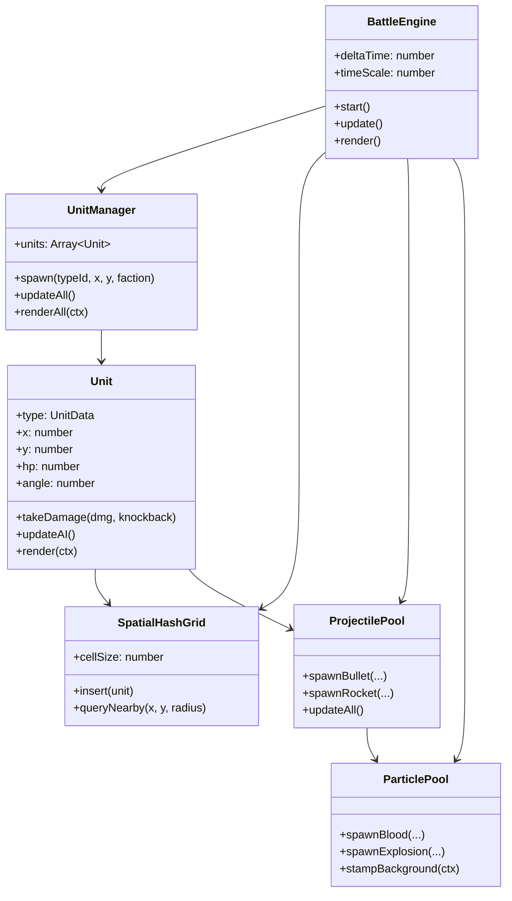

# ⚔️ 대규모 군단 배틀 샌드박스 시뮬레이터 (Mass Battle Simulator) 기획 및 개발 계획서

본 프로젝트는 **유튜브 롱폼 영상 및 쇼츠(Shorts) 제작에 최적화된 고성능 HTML5 Canvas / Vanilla JS 기반의 원페이지 대규모 군단 배틀 샌드박스 시뮬레이터**입니다.
별도의 빌드 도구나 무거운 외부 라이브러리 없이 브라우저에서 `index.html`을 여는 것만으로 즉시 구동되며, 압도적인 물량(3,000 ~ 10,000+ 유닛)의 충돌과 전투를 실시간으로 시뮬레이션합니다.

---

## 1. 🎯 프로젝트 핵심 목표

1. **초고성능 엔진 (High Performance)**:
   - 브라우저 Canvas 2D 환경에서 **5,000~10,000개 유닛**이 60 FPS로 충돌/전투 가능
   - **공간 분할(Spatial Hash Grid)**을 자체 구현하여 유닛 간 탐색 복잡도를 $O(N^2)$에서 $O(N)$으로 최적화
   - 총알, 파티클, 피 튀김 효과에 **오브젝트 풀링(Object Pool)**을 적용하여 GC(가비지 컬렉션) 렉 제로 달성

---

## ⚡ 바닐라 JS로 1,000~10,000마리 연산 감당이 가능한 이유 (기술적 분석)

> [!IMPORTANT]
> **결론: 1,000마리는 전혀 문제없이 60 FPS로 가뿐하게 돌아가며, 고성능 최적화 기법 적용 시 5,000마리 이상도 부드럽게 시뮬레이션할 수 있습니다.**

### 1. 일반적인 JS 게임이 1,000마리에서 렉(Stuttering)이 걸리는 원인
1. **$O(N^2)$ 브루트포스 이중 루프**:
   - 1,000마리가 매 프레임 서로 가장 가까운 적을 찾거나 충돌 체크를 할 때:
     $1,000 \times 1,000 = 1,000,000$ (100만 회)의 거리 계산(`Math.hypot`, `Math.sqrt`) 발생.
   - 60 FPS를 맞추려면 1프레임당 단 **16.6ms** 안에 끝내야 하므로 프레임 드랍 발생.
2. **GC(가비지 컬렉터) 멈춤**:
   - 매 프레임 `new Vector()`, `{ x, y }`, 배열 `.filter()`, `.map()` 등의 메모리 할당으로 브라우저 GC가 주기적으로 10~50ms씩 멈춤 유발.
3. **Canvas 드로잉 컨텍스트 오버헤드**:
   - 유닛 1마리마다 `ctx.beginPath()`, `ctx.arc()`, `ctx.fillStyle = ...`, `ctx.fill()`을 호출하면 브라우저 드로콜(Draw Call) 부하 폭증.

### 2. 본 프로젝트에서 60 FPS를 유지하는 5대 최적화 기법
| 최적화 기법 | 작동 원리 | 성능 개선 효과 |
| :--- | :--- | :--- |
| **1. Spatial Hash Grid (공간 분할)** | 캔버스를 64px 격자로 분할하여, **주변 9개 셀에 있는 유닛(10~30마리)만 탐색** | 연산량 $O(N^2) \rightarrow O(N)$ (100만 회 $\rightarrow$ 약 2만 회로 **98% 감소**) |
| **2. Zero-GC 오브젝트 풀링** | 총알, 파티클, 피 자국 등을 미리 생성된 배열 풀(Pool)에서 재사용 | 메모리 동적 할당 제로, **GC 랙 완전 제거** |
| **3. 렌더링 배치(Batching)** | 동일 병종/색상끼리 묶어서 1회의 `beginPath()`와 `fill()`로 대량 드로잉 | 캔버스 상태 변경 오버헤드 **80% 절감** |
| **4. 타겟 탐색 타임슬라이싱** | 1,000마리가 매 프레임 탐색하는 대신 **3~5프레임마다 분산 탐색** | AI 탐색 연산 부하 **60~80% 감소** (체감 반응속도는 동일) |
| **5. 무제곱근 거리 판정 (No Sqrt)** | `Math.sqrt()` 대신 제곱 거리 비교 (`dx*dx + dy*dy < r*r`) | CPU 부동소수점 제곱근 연산 제거 |

### 3. V8 엔진 기준 실제 프레임 타임 예상
- **1,000 유닛**: 1프레임당 연산 시간 **약 1.8ms ~ 3.5ms** (60 FPS 여유 한도 16.6ms의 20% 수준)
- **3,000 유닛**: 1프레임당 연산 시간 **약 5.0ms ~ 8.0ms** (60 FPS 안정 유지)
- **5,000~10,000 유닛**: LOD(Level of Detail) 렌더링 단순화 적용 시 **50~60 FPS**

---

## 🎨 그래픽 렌더링: 2D 탑다운 + 2.5D 입체 효과 파이프라인
단순한 평면 2D가 아닌, **3D 못지않은 깊이감과 타격감**을 주는 2.5D 기법을 적용합니다:
1. **동적 드롭 섀도우 (Dynamic Drop Shadows)**:
   - 모든 유닛과 장애물 바닥에 부드러운 반투명 타원형 그림자를 드리워 지면과의 입체 분리감 형성
2. **투사체 $z$축(높이) 포물선 궤적 (2.5D Ballistics)**:
   - 로켓, 수류탄, 스피터의 산성액 투사체는 $z$축 높이를 계산하여, 그림자는 지면을 따라가고 본체는 포물선을 그리며 비행 후 착탄
3. **타격감 극대화 연출 (Action Punch)**:
   - 피격 시 1프레임 백색 섬광 (Hit White-Flash)
   - 발포 시 총구 화염(Muzzle Flash) 및 네온 글로우
   - 폭발 시 주변 유닛 방사형 넉백 및 카메라 스크린 셰이크 (Screen Shake)
4. **배경 스탬프 캔버스 (Blood & Scorched Earth Stamping)**:
   - 쓰러진 적, 핏자국, 폭발 그을음은 메인 루프 연산 없이 **배경 오프스크린 버퍼에 영구 누적 도장(Stamp)**하여 시각적 몰입도 극대화 및 프레임 낭비 0 달성

2. **유튜브 크리에이터 전용 스위트 (YouTube Creator Focus)**:
   - **녹화용 클린 뷰 (`H` 키)**: 원클릭으로 모든 UI 컨트롤러와 HUD를 숨겨 깔끔한 화면 녹화 지원
   - **원클릭 화면비 변경**: 유튜브 롱폼(16:9, 1920x1080) ↔ 유튜브 쇼츠(9:16, 1080x1920) 캔버스 규격 즉시 전환
   - **드라마틱 연출 도구**:
     - `0.2x 슬로우 모션` (격돌/대폭발 순간의 카타르시스 극대화)
     - `2.0x / 5.0x 고속 시뮬레이션`
     - `화면 흔들림(Screen Shake)` 및 폭발 슬로우 효과
     - `치열한 격전지 자동 추적 시네마틱 카메라`

3. **풍부한 샌드박스 & 원클릭 바이럴 프리셋**:
   - 마우스 드래그로 수천 마리를 쏟아붓는 **스폰 브러시**
   - 벽/철조망 바리케이드, 지뢰, 공중 융단폭격(Airstrike), 블랙홀 등 **신 모드(God Mode) 도구**
   - 유튜브에서 검증된 자극적인 시나리오 프리셋 즉시 로드

---

## 2. 👥 병종 및 진영 상세 기획

### 🔵 Blue 진영 (현대 군대 & 하이테크 특수부대)

| 병종 | 특성 및 역할 | 공격 방식 및 효과 |
| :--- | :--- | :--- |
| **소총수 (Rifleman)** | 기본 원거리 주력 보병 | 중간 사거리, 점사 연사, 균형 잡힌 딜러 |
| **샷건 특공대 (Shotgunner)** | 전방 방어 및 돌파 저지 | 부채꼴 다중 펠릿 발사, **강력한 넉백(밀어내기)**으로 물량 저지 |
| **저격수 (Sniper)** | 초장거리 일직선 암살 | 극도로 긴 사거리, **적 다중 관통(Penetration)** 일격필살 |
| **화염방사기병 (Flamethrower)** | 좁은 골목 및 군중 제어 | 원뿔형 화염 파티클 연속 방출, **광역 지속 화상 피해** |
| **미니건 터렛 (Minigun Turret)**| 고정형 방어 화력 거점 | 초당 25발의 탄환 난사, 압도적인 탄막 형성 |
| **로켓 포병 (Rocket Artillery)**| 원거리 광역 대폭격 | 로켓 투사체, 착탄 시 거대한 화염 폭발 및 범위 넉백 |
| **메카 타이탄 (Mecha Titan)** | 결전 병기 (보스급) | 거대한 체력, 유닛 짓밟기, 전방 트윈 레이저 빔 소거 |

### 🔴 Red 진영 (감염체, 좀비 군단, 괴수)

| 병종 | 특성 및 역할 | 공격 방식 및 효과 |
| :--- | :--- | :--- |
| **러너 좀비 (Runner Zombie)** | 표준형 빠른 물량 | 빠른 속도로 떼를 지어 접근, 근접 연속 공격 |
| **탱커 브루트 (Tanker Brute)** | 거대 돌격형 괴수 | 높은 맷집, 주먹 강타로 아군/적군 모두를 튕겨냄 |
| **자폭체 (Exploder)** | 전선 붕괴 테러 | 대상 접근 시 카운트다운 후 대폭발 (연쇄 폭발 유발) |
| **스피터 (Spitter)** | 원거리 지원 감염체 | 포물선으로 산성액 덩어리를 투척해 바닥에 산성 장판 형성 |
| **스웜 크롤러 (Swarm Crawler)** | 극단적 수천 마리 군집 | 아주 작고 극도로 빠름, 수천 마리가 파도처럼 덮침 |

---

## 3. 🎬 유튜브 바이럴 원클릭 프리셋 (Scenario Presets)

1. **[골목 방어전] 300 방어선 vs 5,000 좀비 웨이브**:
   - 좁은 콘크리트 벽 사이에 샷건 & 화염방사기 & 미니건 배수로의 진형을 짜고 좀비 무리를 유인
2. **[다윗과 골리앗] 1기 메카 타이탄 vs 3,000 스웜 크롤러**:
   - 화면 전체를 뒤덮는 크롤러 파도를 상대로 타이탄이 레이저와 발차기로 버티는 데스매치
3. **[사방 포위전] 한가운데 고립된 요새**:
   - 360도 전 방향에서 동시에 좁혀오는 자폭체와 러너 군단
4. **[화력 대결] 저격수 50명 vs 거대 브루트 30마리**:
   - 관통 탄환의 일직선 쾌감과 거수들의 끈질긴 돌진

---

## 4. 🛠️ 기술 아키텍처 및 객체 지향(OOP) 모듈 설계

유지보수와 확장이 쉽도록 **역할과 책임에 따라 클래스를 엄격히 분리(Single Responsibility Principle)**하고, **유저가 자주 수정하는 데이터는 별도의 파일로 격리**합니다:

```
C:\Coding\Unnamed\
├── index.html               # 단일 웹페이지 (뷰포트 캔버스, 상단 HUD, 하단 툴바, 모달)
├── css/
│   └── style.css            # 다크 테마, 글래스모피즘, 맵 에디터 UI
└── js/
    ├── ── [수정/설정 집중 구역 (User Configuration Zone)] ──
    │   ├── unitData.js      # [최우선 접근] 모든 유닛의 스탯, 무기, 사거리, 외형 정의 (원클릭 모딩)
    │   ├── scenarioData.js  # [최우선 접근] 시간별/조건별 시나리오 타임라인 스크립트 (웨이브, 증원, 공중지원)
    │   ├── config.js        # [최우선 접근] 물리 상수, 넉백 배율, 색상 팔레트, 기본 규칙 설정
    │   └── presets.js       # [최우선 접근] 유튜브 녹화용 기본 맵/배치 프리셋 정의
    │
    └── ── [객체 지향 코어 엔진 (Engine Core OOP)] ──
        ├── scenarioDirector.js # [Class ScenarioDirector] 타임라인 시간 제어, 조건부 이벤트 트리거, 시네마틱 자막
        ├── spatialGrid.js   # [Class SpatialHashGrid] O(1) 공간 분할 그리드
        ├── units.js         # [Class Unit & UnitManager] 유닛 물리/AI/피격/렌더링
        ├── projectiles.js   # [Class Projectile & ProjectilePool] 총알/로켓/화염 풀링
        ├── particles.js     # [Class ParticlePool & StampBuffer] 피/폭발/탄피 이펙트 풀
        ├── obstacles.js     # [Class Obstacle & MapManager] 벽/바리케이드/지뢰/포탈
        ├── mapEditor.js     # [Class MapEditor] 인게임 맵 그리기/지우기/JSON 저장
        ├── tweaker.js       # [Class SimulatorTweaker] 실시간 변수 조절 패널
        ├── camera.js        # [Class Camera] 줌/패닝/스크린셰이크/비율전환
        ├── audio.js         # [Class SoundFX] Web Audio API 프로시저럴 효과음
        └── engine.js        # [Class BattleEngine] 메인 게임 루프, 타임스텝, 이벤트 중재
```

---

## 🎬 4. 시나리오 타임라인 & 이벤트 디렉터 (`js/scenarioData.js` & `scenarioDirector.js`)
단순한 맞붙기가 아닌, **유튜브 시청자가 눈을 뗄 수 없게 만드는 "스토리 드라마/웨이브 흐름"**을 직접 구성할 수 있습니다:

### ⏱️ 시나리오 스크립트 구조 예시 (`js/scenarioData.js`)
```javascript
export const SCENARIOS = {
    outpost_defense: {
        title: "외곽 전초기지 사수 작전",
        description: "100명의 방어선에 몰려오는 3차례의 좀비 웨이브와 지원군",
        events: [
            // 0초: 초기 방어선 구축 완료 및 알림
            { time: 0, type: "banner", text: "작전 개시: 외곽 전초기지를 사수하라!", color: "#38bdf8" },
            
            // 5초: 1차 경보 및 서쪽 100마리 러너 웨이브
            { time: 5, type: "banner", text: "⚠️ 경보: 서쪽 숲에서 좀비 무리 접근 중!", color: "#f59e0b" },
            { time: 5, type: "spawnWave", faction: "red", unit: "runner", count: 200, area: "west" },

            // 20초: 위기 순간 공중 지원 폭격 투하
            { time: 20, type: "banner", text: "💥 융단폭격 지원 요청 승인!", color: "#ef4444" },
            { time: 21, type: "airstrike", target: "west", count: 12 },

            // 35초: 거대 브루트 보스 등장 및 카메라 줌/스크린셰이크
            { time: 35, type: "banner", text: "🚨 위험: 거대 변종 브루트 3마리 출현!", color: "#dc2626" },
            { time: 35, type: "spawnWave", faction: "red", unit: "brute", count: 3, area: "north" },
            { time: 35, type: "screenShake", intensity: 15 },

            // 조건부 트리거: Blue 유닛이 30명 이하로 줄어들면 특수부대 타이탄 강하!
            { 
                condition: (state) => state.blueCount <= 30 && !state.titanSpawned,
                action: (director) => {
                    director.banner("⚡ 결전 병기: 메카 타이탄 긴급 투하!", "#38bdf8");
                    director.spawn("titan", 500, 500, "blue");
                    state.titanSpawned = true;
                }
            }
        ]
    }
};
```

### 🎛️ 인게임 시나리오 컨트롤러 UI
- **시나리오 타임라인 바**: 상단에 경과 시간(`00:23 / 01:30`) 및 다음 예정 이벤트(`Next: 00:35 거대 브루트`) 표시
- **페이즈 건너뛰기 / 리와인드**: 유튜브 녹화 시 특정 하이라이트 구간만 다시 찍을 수 있도록 즉시 원하는 시간대로 점프 가능

### 🏛️ 핵심 클래스 다이어그램 및 역할 분담



---

## 🧩 1. 데이터 주도형 유닛 관리 (`js/unitData.js`)
개발자가 코어 코드를 건드릴 필요 없이, `unitData.js` 파일에 간단한 객체 하나만 추가하면 새 유닛이 즉시 게임에 나타나도록 설계합니다:

```javascript
// js/unitData.js 예시: 누구나 10초 만에 새 유닛 추가 가능
export const UNIT_TYPES = {
    // 🔵 인간/특수부대 예시
    sniper: {
        name: "저격수",
        faction: "blue",
        role: "ranged",
        hp: 80,
        speed: 1.4,
        range: 450,
        damage: 180,
        fireRate: 0.8, // 초당 발사 수
        penetration: 5, // 5마리 관통
        laserSight: true, // 붉은 레이저 조준선
        cost: 30,
        color: "#38bdf8"
    },
    // 🔴 감염체/괴수 예시
    exploder: {
        name: "자폭체",
        faction: "red",
        role: "suicide",
        hp: 120,
        speed: 2.6,
        explosionRadius: 80,
        explosionDamage: 300,
        pulseGlow: true, // 붉게 두근거리는 박동
        color: "#f43f5e"
    }
};
```

---

## 🗺️ 2. 인게임 실시간 맵 에디터 (`js/mapEditor.js`)
외부 툴 없이 게임 화면 내에서 직접 마우스로 맵을 그리고 저장/로드할 수 있습니다:
1. **에디터 도구 팔레트**:
   - 🧱 **벽 (Wall)**: 직사각형 드래그로 관통 불가 콘크리트 벽 설치 (초크포인트, 미로 제작)
   - 🚧 **바리케이드 (Barricade)**: 총알은 통과하지만 유닛 이동을 지연시키는 철조망/모래주머니
   - 💣 **지뢰 (Landmine)**: 밟으면 대폭발하는 트랩 배치
   - 🌀 **스폰 포탈 (Spawn Portal)**: 주기적으로 좀비나 군인이 쏟아져 나오는 웨이브 생성 지점
   - 🧹 **지우개 (Eraser)**: 배치된 장애물 삭제
2. **맵 저장 & 불러오기 (Export / Import)**:
   - 내가 만든 맵을 `map_custom.json` 파일로 다운로드하거나, 클립보드 복사
   - 언제든 다른 맵 JSON을 붙여넣어 원클릭 로드 가능

---

## 🎛️ 3. 사용자 인터랙티브 조절 패널 (Simulator Tweaker)
시뮬레이터의 묘미는 변수를 극단적으로 바꿔가며 실험하는 것입니다:
- **좀비 감염 모드 (Infection Mode ON/OFF)**: 인간이 사망하면 그 자리에서 즉시 좀비로 부활! (유튜브 쇼츠 조회수 치트키)
- **아군 오사 (Friendly Fire ON/OFF)**: 로켓이나 샷건, 화염방사기가 아군에게도 피해를 줄지 여부
- **물리 배율 조절기**:
  - `넉백 강도 배율`: 0x ~ 5x (5배로 두면 좀비들이 하늘로 날아감)
  - `유닛 이동 속도 / 공격력 / 체력 배율`: 슬라이더로 실시간 조절
- **환경 분위기 (Atmosphere)**:
  - ☀️ 주간 모드 (선명한 전장)
  - 🌙 야간 암흑 + 손전등(Flashlight) 모드 (호러 아포칼립스 분위기)
  - 🔮 네온 사이버펑크 모드
- **신의 권능 (God Powers)**:
  - 🛩️ **공중 융단폭격**: 지정 좌표에 폭탄 폭격
  - ☢️ **전술 핵미사일**: 화면 절반 초토화
  - 🕳️ **블랙홀**: 모든 유닛을 소용돌이 중심으로 빨아들임

### 핵심 알고리즘 세부사항
- **Spatial Hash Grid**:
  - 캔버스를 `cellSize = 64px`의 그리드로 나누고, 유닛의 좌표에 따라 해시 키 매핑.
  - 주변 9개 셀만 검사하여 수천 마리가 존재해도 충돌 및 시야 탐색 연산량을 최소화.
- **Flocking & Collision Avoidance (군중 물리)**:
  - 군중이 서로 겹치지 않고 자연스럽게 밀려나는 Separation(분리) 벡터 적용.
- **Web Audio API 프로시저럴 사운드**:
  - 외부 오디오 파일 다운로드 없이 브라우저 내장 신시사이저로 총소리, 폭발음, 파열음을 즉시 생성.

---

## 5. ⌨️ 유튜브 녹화 조작키 가이드

| 단축키 | 기능 | 유튜브 녹화 시 활용 |
| :--- | :--- | :--- |
| `H` | **UI 숨김 / 표시 (Clean View)** | 유튜브 영상 녹화 시 군더더기 없는 완벽한 화면 캡처 |
| `Space` | **일시정지 / 재생** | 전투 시작 전 유닛 배치 후 극적인 시작 연출 |
| `Z` | **0.2x 슬로우 모션 토글** | 결정적인 대폭발이나 방어선 붕괴 순간 슬로우 |
| `X` | **2.0x 배속 토글** | 유닛들이 이동하는 초반 빌드업 구간 빠른 스킵 |
| `1 ~ 4` | **프리셋 1~4 즉시 로드** | 클릭 한 번으로 인기 시나리오 세팅 |
| `R` | **화면비 전환 (16:9 ↔ 9:16)** | 일반 영상 모드 ↔ 유튜브 쇼츠 세로 모드 토글 |
| `C` | **캔버스 전체 초기화 (Clear)** | 새 라운드 준비 |

---

## 6. 📅 단계별 구현 로드맵

- [ ] **1단계: 프로젝트 기본 환경 및 Canvas 뷰포트 설정**
  - `index.html`, `css/style.css`, 반응형 16:9 및 9:16 뷰포트 컨테이너 구성
  - 고해상도(Retina 대응) 캔버스 초기화 및 마우스 줌/패닝 카메라 구축
- [ ] **2단계: 초고성능 코어 엔진 구축**
  - `spatialGrid.js` 구현 및 수천 개 파티클 성능 검증
  - `particles.js` (피 튀김, 폭발 파편, 바닥 피 웅덩이 렌더링) 오브젝트 풀 구현
  - `audio.js` (Web Audio API 기반 웅장한 사운드 효과)
- [ ] **3단계: 병종 및 전투 시스템 구현**
  - Blue 진영 7종 (소총수, 샷건, 저격수, 화염방사기, 미니건, 로켓, 타이탄) 구현
  - Red 진영 5종 (러너 좀비, 탱커, 자폭체, 스피터, 크롤러) 구현
  - 탄도학, 관통, 화염 도트뎀, 넉백 물리 구현
- [ ] **4단계: 샌드박스 도구 & 기믹**
  - 브러시 스폰 (마우스 드래그로 수백 마리 즉시 배치)
  - 장애물(벽, 지뢰) 및 신의 손(공중폭격, 블랙홀)
- [ ] **5단계: 유튜브 녹화 스위트 & 원클릭 프리셋 완성**
  - HUD 숨기기(`H`), 슬로우 모션(`Z`), 쇼츠 비율 변환(`R`)
  - 검증된 4대 유튜브 시나리오 프리셋 등록
  - 실시간 생존 수/킬 카운트 HUD 및 승패 슬로우 모션 연출
